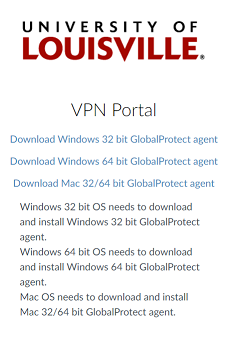

@title[Helton GIS Lab: Remote Access ]
Helton GIS Lab: Remote Access 
-------------------------------
### @fa[globe fa-5x]

###### Use the @fa[angle-down] and @fa[angle-right] arrows to navigate
---
##### VPN Connection
Part 1: VPN Connection
If this is your first time connecting to UofL’s VPN on your computer, you must visit https://vpn.louisville.edu, login using your ULINK credentials, and then download and install the VPN client for your operating system.
+++

+++
Open the GlobalProtect client, and Enter 'vpn.louisville.edu' in the Portal box

+++
Log into the VPN client with your ULink credentials. 

+++
Leave the VPN client open and connected throughout your session

---
##### Remote Desktop Connection
Mac users: please download the [Remote Desktop app](https://apps.apple.com/us/app/microsoft-remote-desktop/id1295203466?mt=12) from the App Store, and then follow the directions in [this video](https://youtu.be/HpMRE2LRjlw) to set up the connection.
+++
Windows users: Search for "remote" in the Windows Search bar. Click on "Remote Desktop Connection" in the results. 

+++
Type the computer name in the Computer box.

+++
 In the “Enter your credentials” window, click **More choices**, and then **Use a different account**.

+++
In the User name box that appears, type “ad\” followed by your Ulink user ID. Enter your password in the Password box. Check the Remember me box to save your credentials for future sessions. Click OK to continue. 

+++
You should now be greeted with a Windows desktop for your assigned lab machine. You can tell that this is a remote connection because of the blue menu bar at the top of the screen. 

+++
 You may now use the remote PC for your classwork. Here are a few tips to ensure a good experience.

- USB devices plugged into your physical machine will not register on the remote PC. The easiest way to move data back and forth is through a cloud storage option like Cardbox or Google Drive.
- Your instructor may post datasets to Blackboard. In this case, open your Blackboard course in a web browser on the remote PC and download those datasets to the remote PC, not to the physical machine you are connecting from. Your remote PC is on UofL’s gigabit network, so downloads should be very speedy. 
- You may create a folder on the C:\ drive in which to store your work. Please name it according to this convention: userID-CourseNumber. For instance, Jon Snow (the [physician](https://www.arcgis.com/apps/MapJournal/index.html?appid=781630562fea4ad88e94bd22e161ba06&webmap=f4d1c17a8f1544c8903060a1e329103a), not the [true heir to the Iron Throne](https://www.insider.com/game-of-thrones-jon-snow-rightful-heir-iron-throne-targaryen-succession-2017-8)), taking Geography 500, would name his folder j0snow01-GEOG500.  
+++
##### THE MOST IMPORTANT THING!!

The **MOST IMPORTANT THING** that you MUST remember each time you use a remote PC, is to LOG OFF the machine when you are finished. 

Click the Windows icon, then click the user icon and choose Sign out.

That’s it...that’s the deal. Good luck and please contact Donald J Biddle via MS Teams or email at [djbidd01@louisville.edu](mailto:djbidd01@louisville.edu). 